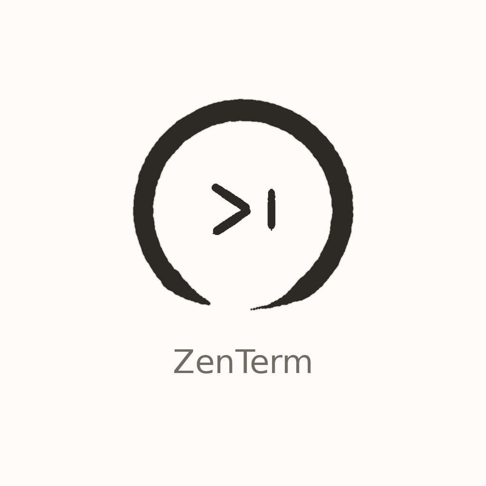
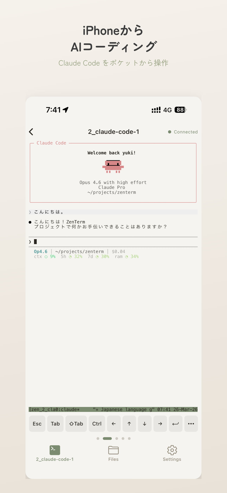
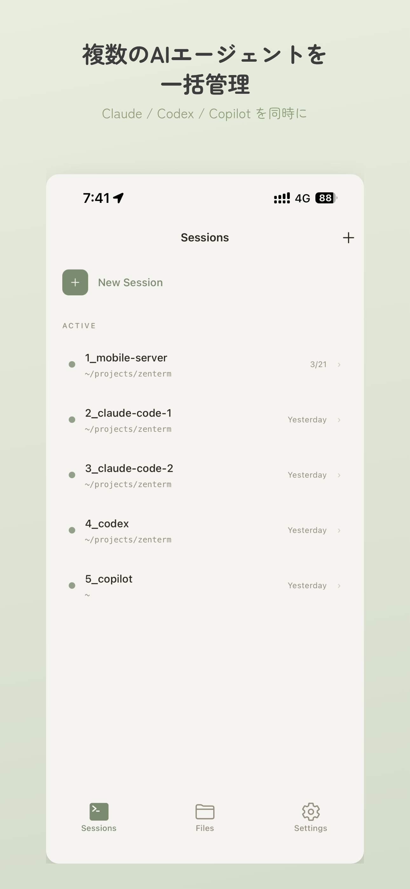
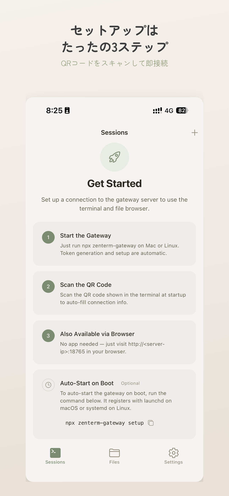
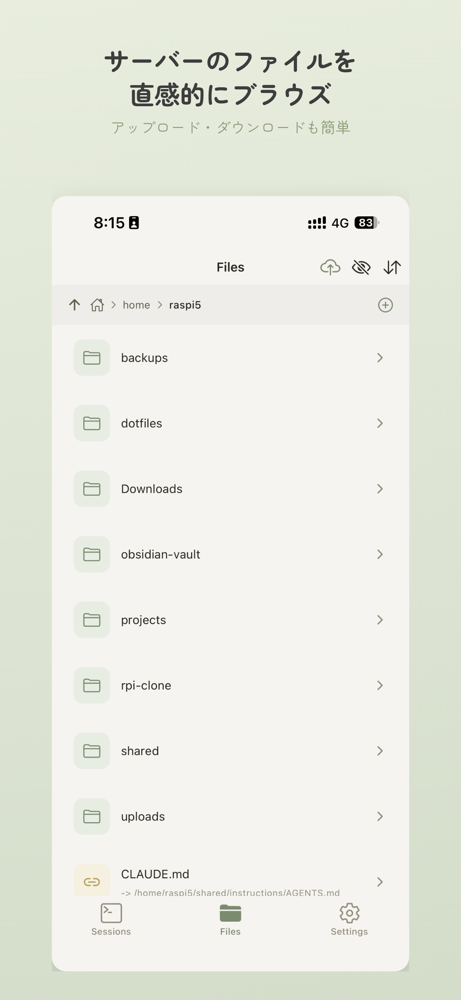
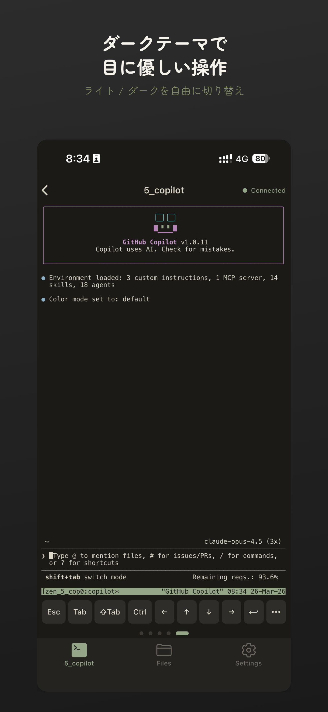

<p align="center">
  
</p>

<h1 align="center">ZenTerm</h1>

<p align="center">
  iPhone / PC からサーバーのターミナルに接続するセルフホスト型モバイルターミナル
</p>

<p align="center">
  = 20">
  
  
</p>

---

Gateway サーバーが tmux セッションを管理し、WebSocket で iPhone アプリや PC ブラウザからリアルタイム接続。xterm.js による本格ターミナル描画、ファイルブラウザ、システムモニタリングを備えます。

Mac mini・Raspberry Pi・Linux サーバーなどに LAN / VPN 経由でどこからでもアクセスできるセルフホスト型ターミナルシステムです。macOS でも Linux でも、サーバーを 1 台セットアップするだけで、iPhone の QR ペアリングですぐに使い始められます。

## Screenshots

<p align="center">
  
  &nbsp;
  
  &nbsp;
  
  &nbsp;
  
  &nbsp;
  
</p>

> 上記はモバイルアプリのスクリーンショットです。Web UI のスクリーンショットは今後追加予定です。

## Features

| | 機能 | 説明 |
|---|---|---|
| **Terminal** | フルターミナル | xterm.js による本格描画、CJK / Unicode 対応、スクロールバック 5,000 行 |
| **Sessions** | tmux セッション管理 | セッションの作成・一覧・アタッチ・デタッチ・削除を REST + UI で操作 |
| **Files** | ファイルブラウザ | ディレクトリ閲覧・テキスト編集・ファイルアップロード |
| **Monitor** | システムモニタリング | CPU / メモリ / ディスク / 温度 / 稼働時間をリアルタイム表示 |
| **QR** | QR ペアリング | Gateway 起動時に QR を表示、アプリでスキャンして即接続 |
| **Web** | Web ダッシュボード | モバイルアプリなしでもブラウザからアクセス可能 |
| **Reconnect** | 自動再接続 | 埋め込み / モバイル端末で指数バックオフ再接続 (最大 20 回)、サーバー側 ping/pong (30 秒) |
| **Install** | ワンライナー | systemd / launchd サービスとして自動登録 |

## Architecture

```
 iPhone (ZenTerm App)             Linux / macOS Server
┌─────────────────────┐          ┌───────────────────────────────────┐
│                     │          │  zenterm-gateway (Fastify)        │
│  ┌───────────────┐  │   WS    │  ┌─────────────┐  ┌───────────┐  │
│  │ WebView       │◄─┼────────►│  │ /ws/terminal │──│ node-pty  │  │
│  │ (xterm.js)    │  │  embed  │  └─────────────┘  └─────┬─────┘  │
│  └───────┬───────┘  │         │                         │        │
│  GET /embed/terminal │  REST   │  ┌─────────────┐  ┌─────▼─────┐  │
│  ┌───────────────┐  │         │  │ /api/*      │  │   tmux    │  │
│  │ Native UI     │◄─┼────────►│  │ sessions    │  └───────────┘  │
│  │ (Sessions,    │  │         │  │ files       │                  │
│  │  Files, etc.) │  │         │  │ system      │  ┌───────────┐  │
│  └───────────────┘  │         │  │ upload      │  │ /app/*    │  │
│                     │         │  └─────────────┘  │ Web SPA   │  │
└─────────────────────┘         │                   │ /embed/*  │  │
                                └───────────────────┴───────────┘──┘

 PC Browser (Web Client)
┌─────────────────────┐
│  React SPA           │  ── GET /app/* ──►  Gateway が配信
│  xterm.js + zustand  │  ── WS  ────────►  /ws/terminal
└─────────────────────┘
```

## Package Structure

```
packages/
├── gateway/   Fastify + WebSocket + node-pty ターミナルゲートウェイ
├── web/       React + Vite — PC 向け Web クライアント
└── shared/    WebSocket メッセージ型・共通型定義 (Single Source of Truth)
```

| パッケージ | 技術スタック |
|-----------|-------------|
| **gateway** | Node.js, TypeScript, Fastify 5, ws, node-pty, tmux, zod |
| **web** | React 19, Vite, React Router, zustand, xterm.js, CSS Modules |
| **shared** | TypeScript 型定義のみ — gateway / web / mobile で共有 |

## Requirements

- **Node.js** >= 20
- **tmux** (セッション管理に必須)
- **npm** (workspaces 対応)
- **ビルドツール** (node-pty のネイティブコンパイルに必要)
  - Linux: `build-essential` (`make`, `gcc`), `python3`
  - macOS: Xcode Command Line Tools (`xcode-select --install`)

## Quick Start

### One-liner Install (recommended)

```bash
git clone https://github.com/phni3j9a/zenterm.git
cd zenterm && ./deploy/install.sh
```

`install.sh` が以下を自動実行します:

1. tmux / Node.js の確認
2. Gateway + Web ビルド
3. `AUTH_TOKEN` の対話的生成
4. サービス登録 (Linux: systemd / macOS: launchd)
5. 起動確認 + QR コード表示

### Manual Setup

```bash
# 依存インストール
npm install

# Gateway ビルド (Web ビルドも自動実行)
npm run build:gateway

# 初回セットアップ (対話的に AUTH_TOKEN を設定)
cd packages/gateway && node dist/cli.js setup

# 起動
npm run dev:gateway
```

起動するとコンソールに QR コードが表示されます。ZenTerm アプリでスキャンして接続してください。

## Configuration

設定ファイル: `~/.config/zenterm/.env`

| 変数 | デフォルト | 説明 |
|------|-----------|------|
| `AUTH_TOKEN` | *(必須)* | Bearer 認証トークン |
| `PORT` | `18765` | リッスンポート |
| `HOST` | `0.0.0.0` | バインドホスト |
| `SESSION_PREFIX` | `zen_` | tmux セッション名プレフィックス |
| `LOG_LEVEL` | `info` | ログレベル (`debug` / `info` / `warn` / `error`) |
| `UPLOAD_DIR` | `~/uploads/zenterm` | アップロード保存先 |
| `UPLOAD_MAX_SIZE` | `10485760` | アップロード上限 (bytes, デフォルト 10 MB) |

## API Reference

すべての API は Bearer トークン認証が必要です (`/health`, `/embed/terminal`, `/app/*` を除く)。

### REST Endpoints

| メソッド | パス | 説明 |
|---------|------|------|
| `GET` | `/health` | ヘルスチェック (認証不要) |
| `POST` | `/api/auth/verify` | トークン検証 |
| `GET` | `/api/sessions` | tmux セッション一覧 |
| `POST` | `/api/sessions` | セッション作成 |
| `PATCH` | `/api/sessions/:sessionId` | セッションリネーム (`{ "name": "..." }`) |
| `DELETE` | `/api/sessions/:id` | セッション削除 |
| `GET` | `/api/system/status` | システムステータス (CPU / メモリ / ディスク / 温度 / 稼働時間) |
| `GET` | `/api/files` | ファイル一覧 (`?path=`) |
| `GET` | `/api/files/content` | ファイル内容取得 (`?path=`, 512 KB 以下) |
| `GET` | `/api/files/raw` | ファイルストリーム配信 (`?path=`, 20 MB 以下) |
| `PUT` | `/api/files/content` | ファイル内容書き込み |
| `POST` | `/api/upload` | ファイルアップロード (multipart, 10 MB 以下) |
| `GET` | `/embed/terminal` | 埋め込みターミナル HTML (認証不要、モバイル WebView 用) |

### WebSocket

**Endpoint:** `WS /ws/terminal?sessionId=<id>&token=<token>`

```jsonc
// Client → Gateway
{ "type": "input",  "data": "ls -la\r" }
{ "type": "resize", "cols": 80, "rows": 24 }
{ "type": "signal", "signal": "SIGINT" }

// Gateway → Client
{ "type": "output",      "data": "..." }
{ "type": "sessionInfo", "session": { "id": "zen_abc", "displayName": "main", ... } }
{ "type": "exit",        "code": 0 }
{ "type": "error",       "message": "..." }
```

## Security

| 対策 | 詳細 |
|------|------|
| Bearer トークン認証 | すべての API / WebSocket に `Authorization: Bearer <token>` が必要 (`/health`, `/embed/terminal`, `/app/*` を除く) |
| タイミングセーフ比較 | `crypto.timingSafeEqual` によるトークン検証でタイミング攻撃を防止 |
| パストラバーサル防止 | ファイル操作はホームディレクトリ内に制限、`..` を含むパスを拒否 |
| シンボリックリンク検証 | symlink 先がホームディレクトリ外の場合はアクセス拒否 |
| WebSocket フレーム制限 | 最大ペイロード 64 KB (`maxPayload`) |
| 同時接続数制限 | WebSocket 最大 10 接続 |
| ファイルサイズ制限 | テキスト読み込み 512 KB / ストリーム配信 20 MB / アップロード 10 MB |

## Support

サポートが必要な場合は、まずこの README の `Quick Start` と `Configuration` を確認してください。接続できない場合は、`tmux` の導入、`AUTH_TOKEN` の一致、ファイアウォールや VPN 経路の到達性を見直すと切り分けしやすくなります。

不具合報告や質問は GitHub Issues で受け付けています。App Store サポート窓口としてもこのリポジトリを案内しています。

- https://github.com/phni3j9a/zenterm/issues
- 報告時は利用端末、サーバー OS、ZenTerm のバージョン、再現手順を添えてください

## Development

```bash
# Gateway 開発サーバー (ホットリロード)
npm run dev:gateway

# Web 開発サーバー (Vite, port 5173 → proxy → Gateway)
npm run dev:web

# テスト
cd packages/gateway && npx vitest
```

### Build

```bash
# Web をビルドして gateway/public/app/ に出力
npm run build:web

# Gateway をビルド (Web ビルドも自動実行)
npm run build:gateway
```

## Deployment

### Linux (systemd)

```bash
# ステータス確認
sudo systemctl status zenterm-gateway

# ログ確認
sudo journalctl -u zenterm-gateway -f

# 再起動
sudo systemctl restart zenterm-gateway

# アンインストール
./deploy/uninstall.sh
```

### macOS (launchd)

```bash
# ステータス確認
launchctl list | grep zenterm

# ログ確認
tail -f ~/Library/Logs/zenterm-gateway.log
```

詳細は [docs/deployment.md](docs/deployment.md) を参照してください。

## Troubleshooting

### node-pty ビルドエラー

`npm install` 時に node-pty のコンパイルが失敗する場合:

```bash
# Debian / Ubuntu / Raspberry Pi OS 等
sudo apt install -y build-essential python3

# macOS
xcode-select --install
```

### tmux が見つからない

```bash
# Debian / Ubuntu / Raspberry Pi OS 等
sudo apt install -y tmux

# macOS
brew install tmux
```

### ポート競合

デフォルトポート `18765` が使用中の場合、`~/.config/zenterm/.env` の `PORT` を変更してください。

### リバースプロキシ経由で WebSocket が接続できない

Nginx 等のリバースプロキシを使用する場合、WebSocket のアップグレードヘッダーを転送する設定が必要です:

```nginx
location / {
    proxy_pass http://127.0.0.1:18765;
    proxy_http_version 1.1;
    proxy_set_header Upgrade $http_upgrade;
    proxy_set_header Connection "upgrade";
    proxy_set_header Host $host;
}
```

## Roadmap

| Phase | 内容 | 状態 |
|-------|------|------|
| **1** | Web 基盤 (ターミナル, セッション管理, ファイルブラウザ, システム監視) | Done |
| **2** | UX 磨き込み (キーボードショートカット, 自動再接続, レスポンシブ) | Planned |
| **3** | ファイルマネージャ強化 (検索, プレビュー, コンテキストメニュー) | Planned |
| **4** | ペイン分割 (横/縦分割, tmux 連携) | Planned |
| **5** | 高度な機能 (マルチサーバー, 通知, カスタムテーマ) | Planned |

詳細は [docs/roadmap.md](docs/roadmap.md) を参照してください。

## Related

- **ZenTerm App** -- iOS モバイルアプリ (App Store 準備中)
  - 3 タブ構成: Sessions / Files / Settings
  - QR コードスキャンでサーバーとペアリング
  - セッション一覧にインラインターミナルプレビュー
  - スワイプ削除、画像プレビュー、Markdown レンダリング
  - ファイルアップロード (Document Picker + Photo Library)
  - ダーク / ライトテーマ対応
  - Expo SDK 54 / React Native
- **[Privacy Policy](PRIVACY_POLICY.md)** -- プライバシーポリシー

## Contributing

バグ報告や機能リクエストは [Issues](https://github.com/phni3j9a/zenterm/issues) からお願いします。

プルリクエストを送る場合:

1. リポジトリをフォーク
2. フィーチャーブランチを作成 (`git checkout -b feature/your-feature`)
3. テストを実行 (`cd packages/gateway && npx vitest`)
4. コミット & プッシュ
5. プルリクエストを作成

コードスタイルは既存のコードに合わせてください。TypeScript strict モード + Zod バリデーションを使用しています。

## License

[MIT](LICENSE)
